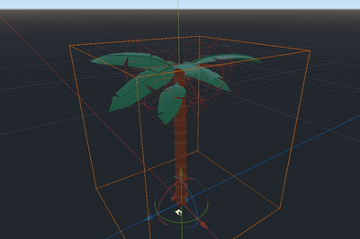

# WiggleBone Skeleton Modifier for Godot Engine 4.3

Adds jiggle physics to a `Skeleton3D` bone using `SkeletonModifier3D` nodes.

> [!NOTE]
> Requires Godot 4.3. As Godot 4.2 and lower does not support `SkeletonModifier3D` nodes, the branch [godot-4.2](https://github.com/detomon/wigglebone/tree/godot-4.2) has an alternative implementation using `Node3D` and can be used as a fallback for existing projects.

- [Installation](#installation)
- [Usage](#usage)
- [Wiggle rotation](#wiggle-rotation)
- [Wiggle position](#wiggle-position)
- [Testing in editor](#testing-in-editor)
- [References](#references)

---

## Installation

1. Search for `wigglebone` in the `AssetLib` editor tab
2. Download and install the plugin
3. Enable the plugin in the project settings via the `Plugins` tab

or...

1. Clone this repository or download the archive
2. Copy the folder `addons/wigglebone` to your project's `addons` folder (create it if needed)
3. Enable the plugin in the project settings via the `Plugins` tab

## Usage

- Add `DMWBWiggleRotationModifier3D` or `DMWBWigglePositionModifier3D` nodes to a `Skeleton3D`.
- Define the `bones` which should be modified.
- Add a property resource (`DMWBWiggleRotationProperties3D` or `DMWBWigglePositionProperties3D`) to define how the bones should behave.

See the [example scenes](https://github.com/detomon/wigglebone/tree/master/examples/wigglebone) for some examples.

**Note:** Poses modified in `SkeletonModifier3D` nodes are only temporary for the current frame. Modifiers for parent bones should come first (above) in the scene tree, otherwise it may have not the desired effect.

> [!WARNING]
> The `WiggleBone` node is deprecated and will be removed in a future release. It should be replaced with either `DMWBWiggleRotationModifier3D` or `DMWBWigglePositionModifier3D`.

## Wiggle rotation

 **DMWBWiggleRotationModifier3D**

Behaves like a spring attached to the bone's current pose and rotates it around its origin. It reacts to global movement, rotation, or applied forces. The current pose direction acts as the spring's rest position.

### Modifier properties

| Property | Description |
|---|---|
| `bones` | A list of bone names to modify with the defined properties. |
| `properties` | Properties which define the spring behaviour. (`DMWBWiggleRotationProperties3D`) |
| `force_global ` | Applies a constant global force. |
| `force_local ` | Applies a constant force relative to the bone's pose. |
| `handle_distance ` | Sets the distance of the editor handle on the bone's Y axis. |

### Property resource

**DMWBWiggleRotationProperties3D**

Sets the modifier properties. Can be shared by multiple modifiers.

| Property | Description |
|---|---|
| `spring_freq ` | The spring's oscillation frequency in `Hz`. *Note: Adding forces may change the frequency.* |
| `angular_damp` | Damping factor of the angular velocity. |
| `force_scale` | Defines how much the rotation is influenced by forces (`°/m`). |
| `linear_scale` | Defines how much the rotation is influenced by global movement (`°/m`). |
| `swing_span` |  Maximum angle in radians the bone can rotate around its pose. |
| `gravity` | Applies a constant global force (`m/s²`). |

### Methods

| Method | Description |
|---|---|
| `void reset()` | Reset rotation and angular velocity. |
| `void add_torque_impulse(torque: Vector3)` | Add a global torque impulse. |
| `void add_force_impulse(force: Vector3)` | Add a global force impulse. |

### Free rotation

To allow the bone to rotate freely, the spring frequency (`spring_freq`) can be set to `0.0` or a very low value.

### Limitations

- Rotations near 180° have a "pole", which means that the bone spins around its forward axis near that limit.
- Rotation with exactly 180° have no unique solution and the bone's forward axis rotation snaps to a fallback axis.
- When the rotation approaches 180° while using a low spring frequency, the angular rotation may change its direction in certain cases.

**Note:** Some of these problems can be avoided by setting the bone pose rotation already to the desired rest position. For example, if a bone is hanging down, the bone pose should already be pointing down.

## Wiggle position

 **DMWBWigglePositionModifier3D**

Behaves like a spring attached to the bone's current pose and moves its origin without rotating. It reacts to global movement or applied forces. The current pose position acts as the spring's rest position.

### Modifier properties

| Property | Description |
|---|---|
| `bones` | A list of bone names to modify with the defined properties. |
| `properties` | Properties which define the spring behaviour. (`DMWBWigglePositionProperties3D`) |
| `force_global ` | Applies a constant global force. |
| `force_local ` | Applies a constant local force relative to the bone's pose. |

### Property resource

**DMWBWigglePositionProperties3D**

Sets the modifier properties. Can be shared by multiple modifiers.

| Property | Description |
|---|---|
| `spring_freq ` | The spring's oscillation frequency in `Hz`. *Note: Adding forces may change the frequency.* |
| `linear_damp` | Damping factor of the velocity. |
| `force_scale` | A factor which defines how much the position is influenced by forces. |
| `linear_scale` | A factor which defines how much the position is influenced by global movement. |
| `max_distance` | Maximum distance in meters the bone can move around its pose position. |
| `gravity` | Applies a constant global force (`m/s²`). |

### Methods

| Method | Description |
|---|---|
| `void reset()` | Reset position and velocity. |
| `void add_force_impulse(force: Vector3)` | Add a global force impulse. |

### Free movement

To allow the bone to move freely, the spring frequency (`spring_freq`) can be set to `0.0` or a very low value.

## Testing in editor

When a `DMWBWiggleRotationModifier3D` or `DMWBWigglePositionModifier3D` node is selected in the scene tree, a force can be applied to it by dragging its handle. Another way is to drag or rotate the `Skeleton3D` or one of its parents.

### Disabling editor gizmos

The editor gizmo (cone/sphere) can be hidden in the 3D viewport by disabling it in `View > Gizmos > DMWBWiggleRotationModifier3D` or `View > Gizmos > DMWBWigglePositionModifier3D`, respectively.

## References

### Springs

Based on **Springs: From Hooke's law to a time based equation** by EgoMooses 
<https://www.youtube.com/watch?v=FZekwtIO0I4>

### Time-independent lerp

**Lerp smoothing is broken** by Freya Holmér 
<https://www.youtube.com/watch?v=LSNQuFEDOyQ>
