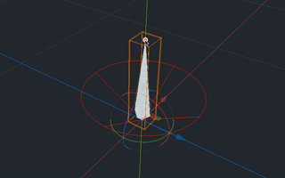

# WiggleBone Plugin for Godot Engine

Adds jiggle physics to bones of a **Skeleton**. The node inherits from **BoneAttachment** and can be used as such. It reacts to animated or global motion and uses the bone's custom pose property to apply the wiggle motion.

It only reacts to acceleration; bones of constantly moving objects will not "lag behind" and have a more realistic behaviour.

See the [example](https://github.com/detomon/wigglebone/tree/master/examples/wigglebone) directory for some examples.

## Node Properties

Title | Name | Description
---|---|---
Enabled | `enabled` | Enables or disables wiggling. When disabled, the bone returns to it's current pose.
Properties | `properties` | Properties are stored in a separate [**WiggleProperties**](#wiggleproperties-resource) resource type.
Constant Force | `const_force` | This applies a global constant force additionally to the gravity already set in [**WiggleProperties**](#wiggleproperties-resource).
Constant Local Force | `const_force_local` | This applies a global constant force additionally to the gravity already set in [**WiggleProperties**](#wiggleproperties-resource) but relative to the bone's current pose.
Bone Name | `bone_name ` | Inherited from **BoneAttachment**. Selects which bone should be used.

## WiggleProperties Resource

Properties are stored in a separate **WiggleProperties** resource type. This way, bone properties can be reused and shared between multiple bones, for example, when bones are symetric.

Title | Name | Description
---|---|---
Mass Center | `mass_center` | The mass center is attached to the bone's end and determines how motion and gravity influences the motion. As there is no way to get the bone length automatically, this point has to be set manually (usually along its Y-axis).
Gravity | `gravity` | The force pulling at the mass center.
Stiffness | `stiffness` | This is the bones tendency to return to its original pose. The higher the value the stronger the pull.
Damping | `damping` | Reduces the bones motion. The higher the value the slower it moves in general.
Mode | `mode` | Two different [pose modes](#pose-modes) are supported: `Rotation` and `Dislocation`.
Max Degrees | `max_degrees` | Available when using `Rotation` pose mode.
Max Distance | `max_distance` | Available when using `Dislocation` pose mode.

## Pose Modes

Two different pose-modes are supported.

### Rotation (`WiggleProperties.Mode.ROTATION`)

The bone rotates around its origin. The rotation angle can be limited with *Max Degrees* (`max_degrees`) to a certain value but has an upper limit of 90° relative to the original pose. All values have a soft limit.

### Dislocation (`WiggleProperties.Mode.DISLOCATION`)

The bone moves relative to its origin but without rotating. The distance can be limited to a certain value with *Max Distance* (`max_distance`). All values have a soft limit.

## Functions

### `apply_impulse(impulse: Vector3, global: bool = true)`

Adds a single impulse force for the next frame. If `global` is `false`, the force is relative to the bone's pose.

### `reset()`

Resets all forces. Can be used, for example, after "teleporting" the character (moving instantaneously a long distance) to prevent overshooting.

## Testing in Editor

A force can be applied to the bone to test the properties in the editor by dragging its handle. When selected, the handle appears at the bone's end when `Rotation` mode is used or at the root when `Dislocation` mode is used, respectively. Another way is to drag or rotate the **Skeleton** or one of its parents directly.
